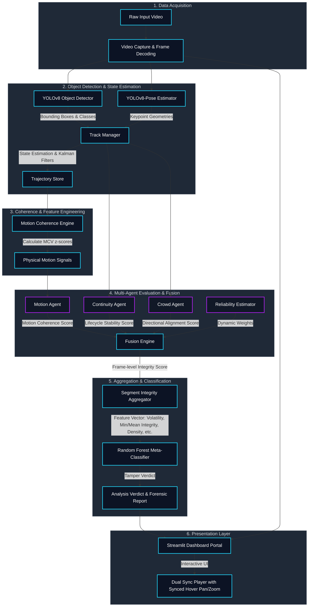

# 🔬 CoheRex-Integrity

> **Multi-Agent Temporal Consistency Verification & Video Forensics Framework**

[](https://www.python.org/)
[](https://github.com/ultralytics/ultralytics)
[](https://streamlit.io/)
[](https://opensource.org/licenses/MIT)

CoheRex-Integrity is a state-of-the-art computer vision and machine learning framework designed to detect **synthetic temporal tampering** (e.g., frame deletions, frame duplications, speed manipulation, clip splicing, and reverse playback) in videos. 

Instead of relying solely on pixel-level artifacts—which are easily masked by standard video re-encoding—CoheRex tracks the physical trajectories and behavior of entities (primarily humans) over time. It models trajectory consistency using multiple specialized **Integrity Agents** and aggregates their outputs using a **Dynamic Reliability-Aware Fusion Engine** combined with a **Random Forest Meta-Classifier**.

---

## 🗺️ System Architecture (Infographic)

The following diagram illustrates the data processing pipeline of the CoheRex-Integrity framework, from raw video input to final tamper detection output:



---

## ✨ Novelty & Key Innovations

*   **Multi-Agent Decoupled Paradigm:** Instead of using a single monolithic detector, CoheRex decouples temporal consistency evaluation into independent agents targeting specific physical properties:
    *   **Motion Agent:** Tracks smooth trajectory physics (velocity, acceleration, angular changes).
    *   **Continuity Agent:** Evaluates tracking lifecycle events (reattachments, dormant frames, missing frames).
    *   **Crowd Agent:** Analyzes collective directional alignment and velocity patterns in crowded scenes.
*   **Robust Motion Coherence Value (MCV):** A custom physical metric computed by calculating the rolling z-score of speed, acceleration, and angle trajectories. Uses a dynamic **noise floor** to prevent score explosion from tiny spatial jitters and protects against outlier-shill effects by comparing the current frame against *prior-only* distributions.
*   **Dynamic Reliability-Aware Fusion:** The system adapts frame-by-frame by scaling agent weights:
    $$\text{Effective Weight}_i = \text{Base Weight}_i \times \text{Reliability}_i$$
    Reliability is dynamically estimated based on detector confidence, track age, state maturity, and scene density, neutralizing untrustworthy agents (e.g. newly initialized tracks or low-confidence detections).
*   **Random Forest Meta-Classifier:** Consolidates aggregated temporal and statistical features across the entire video (e.g., minimum/mean integrity, volatility, anomaly density, log of max MCV) into a single classification pipeline, yielding highly stable tampering verdicts.
*   **Dual-Mode Synchronized Player:** A custom dashboard featuring a HTML5/JS side-by-side synchronized video player (original input vs. annotated output) supporting sub-frame sync, custom speed selection, and **mouse-driven hover pan/zoom synchronization** to investigate local video splices and frame drops visually.

---

## 🛠️ Tech Stack & Frameworks

*   **Core Logic & Processing:**
    *   **Python 3.8+**: System implementation language.
    *   **OpenCV (opencv-python)**: Video parsing, frame decoding, writing, and custom annotation overlays.
    *   **NumPy & SciPy**: Vector mathematics, matrix calculations, statistical metrics, and rolling z-scores.
    *   **Pandas**: Managing structured forensic evaluation datasets.
*   **Computer Vision & Tracking:**
    *   **Ultralytics YOLOv8**: Real-time object detection (`yolov8n.pt`) and human pose keypoint estimation (`yolov8n-pose.pt`).
    *   **FilterPy**: Kalman Filter engine for tracking lifecycle state propagation.
*   **Machine Learning (Meta-Classifier):**
    *   **Scikit-Learn**: Stratified 5-Fold Cross Validation and Random Forest modeling (`RandomForestClassifier`).
    *   **Joblib**: Model serialization and lazy-loading.
*   **Visualization & Presentation:**
    *   **Streamlit**: Interactive dashboard framework.
    *   **Matplotlib**: Rendering dynamic integrity graphs, histograms, ROC curves, and confusion matrices.
    *   **HTML5/CSS3/Vanilla JavaScript**: Powering the custom synchronized video player component inside the Streamlit app.

---

## 📂 Codebase Structure & Components

*   [coherex/](file:///d:/coherex/coherex): Core package directory.
    *   [config.py](file:///d:/coherex/coherex/config.py): Single source of truth for all system parameters, thresholds, and weights (immutable dataclasses).
    *   [config_loader.py](file:///d:/coherex/coherex/config_loader.py): Handles loading configuration parameters from files (e.g., YAML presets).
    *   [detection/](file:///d:/coherex/coherex/detection): Object detection wrappers.
        *   [yolo_detector.py](file:///d:/coherex/coherex/detection/yolo_detector.py): Configures YOLO models and filters target classes (e.g., people).
    *   [tracking/](file:///d:/coherex/coherex/tracking): Multi-object tracking implementation.
        *   [manager.py](file:///d:/coherex/coherex/tracking/manager.py): Orchestrates Kalman Filter tracks, appearance similarities, and pose matching.
        *   [track.py](file:///d:/coherex/coherex/tracking/track.py): Manages individual track lifecycle states (Active, Dormant, Terminated).
        *   [pose.py](file:///d:/coherex/coherex/tracking/pose.py): Processes human skeleton joint associations across frames.
    *   [coherence/](file:///d:/coherex/coherex/coherence): Mathematical coherence computations.
        *   [mcv.py](file:///d:/coherex/coherex/coherence/mcv.py): Computes Motion Coherence Value (z-scores of velocity, acceleration, and angle).
    *   [integrity/](file:///d:/coherex/coherex/integrity): Multi-agent validation core.
        *   [motion_agent.py](file:///d:/coherex/coherex/integrity/motion_agent.py): Translates raw physical MCV values to bounded integrity scores and handles motion-triggered latches.
        *   [continuity_agent.py](file:///d:/coherex/coherex/integrity/continuity_agent.py): Evaluates tracking lifecycle stability, tracking misses, and reattachment penalties.
        *   [fusion_engine.py](file:///d:/coherex/coherex/integrity/fusion_engine.py): Executes static or reliability-weighted multi-agent fusion.
        *   [reliability.py](file:///d:/coherex/coherex/integrity/reliability.py): Dynamically scores agent reliability based on track statistics and context.
    *   [meta/](file:///d:/coherex/coherex/meta): Video-level validation and classification.
        *   [classifier.py](file:///d:/coherex/coherex/meta/classifier.py): Serves Random Forest model inference.
        *   [feature_extractor.py](file:///d:/coherex/coherex/meta/feature_extractor.py): Extracts global statistics (volatility, min/mean integrity, anomaly density) from frame scores.
*   [frontend/](file:///d:/coherex/frontend): User Interface components.
    *   [app.py](file:///d:/coherex/frontend/app.py): The main Streamlit dashboard application code including visual styles and synced players.
*   [scripts/](file:///d:/coherex/scripts): Utility scripts for dataset creation, batch evaluation, testing, model training, and analysis.
*   [data/](file:///d:/coherex/data): System inputs/outputs, videos, evaluation reports, and models directory.

---

## 🖥️ Localhost & Web Dashboard Functionalities

### Launching the Portal
The CoheRex Streamlit dashboard runs locally. To boot the frontend application, execute:
```bash
streamlit run frontend/app.py
```
Upon startup, the server mounts the interactive web interface at:
*   **Local URL:** `http://localhost:8501`

### Interface & Functionalities
1.  **Dual-Panel Controls:**
    *   **Left Box:** Video Upload section. Supports `.mp4`, `.avi`, `.mov`, and `.mkv` files. Displays a preview of the source video upon uploading.
    *   **Right Box:** Live Settings panel. Slide to adjust the segment integrity window size (frames) or select the analysis mode: *Full Pipeline (YOLO + Agents)* or *Lightweight (Optical Flow)*.
2.  **Side-by-Side Synced Video Player:**
    *   Outputs the original input video alongside the annotated output frame-by-frame.
    *   Features synced playback, pause, seeking, speed changes (0.25x to 2x), and sub-frame sync drift correction.
    *   **Synced Zoom-Pan Mirroring:** Move your cursor over either video panel to zoom in and examine target elements. The corresponding coordinate coordinates on the neighboring panel sync automatically.
3.  **Real-Time Analytics & Charts:**
    *   **Temporal Integrity Chart:** Plots frame-level scores and segment-level rolling averages. Identifies detected anomalies with translucent red blocks.
    *   **Distribution Histogram:** Maps the frequency of different integrity values to categorize frames (High Integrity, Moderate Risk, Compromised).
4.  **Forensic Metrics Dashboard:**
    *   Displays macro statistics: Duration, Mean Integrity, Minimum Integrity, Volatility, and Mean Agent Reliabilities.
    *   Shows the **AI Classifier Verdict** (AUTHENTIC, SUSPICIOUS, or TAMPERED) and its confidence score.
5.  **Anomaly Logs:**
    *   A tabular list of exact temporal events violating continuity and physical laws, showing start/end frames, timestamps, and severity.

---

## ⚙️ Operation & Step-by-Step Procedure

Follow these sequential steps to set up, evaluate, train, and run the CoheRex-Integrity framework.

### Step 1: Environment Setup
Ensure Python 3.8+ is installed on your local system. Clone the workspace, create a virtual environment, and install dependencies:
```bash
# Create a virtual environment
python -m venv venv

# Activate virtual environment
# On Windows:
venv\Scripts\activate
# On Linux/macOS:
source venv/bin/activate

# Install required packages
pip install -r requirements.txt

# Install coherex package in editable developer mode
pip install -e .
```

### Step 2: Download Detection Weights
Download the YOLO weight checkpoints and save them to the project root directory:
*   `yolov8n.pt` (Object Detection)
*   `yolov8n-pose.pt` (Pose Estimation)
*(Note: Running the pipeline scripts or Streamlit app will automatically download these weights via Ultralytics if they are not detected locally).*

### Step 3: Create Tampered Forensic Dataset
Synthesize tampered videos for evaluation using the baseline mp4 files:
```bash
python scripts/create_tampered_videos.py
```
This script processes source videos in `data/raw_videos/` and produces 20 authentic segments and 20 tampered clips containing 5 types of anomalies: Frame Deletion, Frame Duplication, Speed Manipulation, Clip Splicing, and Reverse Playback.

### Step 4: Run Batch Evaluation
Execute the feature extraction pipeline on the synthesized dataset to generate tabular evaluations:
```bash
python scripts/evaluate_dataset.py
```
This runs the full tracking and multi-agent system on all videos, outputting a consolidated CSV dataset at `data/evaluation/results_test.csv`.

### Step 5: Train the Meta-Classifier
Train the Random Forest model on the evaluation CSV to enable video-level AI diagnostics:
```bash
python scripts/train_meta_classifier.py --csv data/evaluation/results_test.csv
```
This script executes a stratified 5-fold cross-validation, reports the cross-validation AUC (target $\ge 0.75$), ranks feature importances, prints confusion matrices, and writes the serialized model bundle to `data/models/meta_classifier.pkl`.

### Step 6: Run Single Video Pipeline (CLI)
You can run a forensic check on a single video file directly via the terminal:
```bash
# Run with default settings
python scripts/run_pipeline.py --video data/raw_videos/sample1.mp4

# Run with a forensic YAML preset (stricter detection limits)
python scripts/run_pipeline.py --video data/raw_videos/sample1.mp4 --config forensic.yaml
```
Output annotated videos will be saved in `data/dashboard_output/` and structured evaluation JSON logs will be written to `data/reports/`.

### Step 7: Launch the Web Portal
Run the Streamlit application to explore results interactively:
```bash
streamlit run frontend/app.py
```
Open `http://localhost:8501` in your browser to inspect video integrity visually!

---

## 📈 System Analysis & Performance Tools
The framework includes multiple validation utilities:
*   **ROC Curve Calculator:** Computes and saves ROC plots for overall classifications.
    ```bash
    python scripts/compute_roc.py
    ```
*   **Sensitivity Analysis:** Measures framework AUC across different segmentation windows.
    ```bash
    python scripts/sensitivity_analysis.py
    ```
*   **Ablation Study:** Examines individual agent contributions by disabling/enabling specific detectors.
    ```bash
    python scripts/ablation_study.py
    ```
