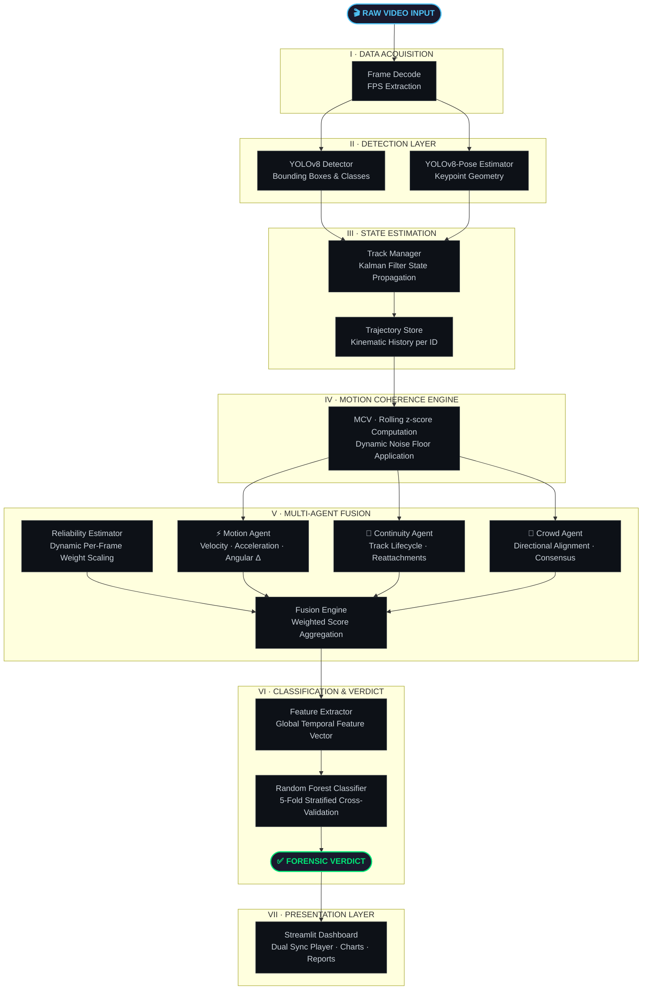
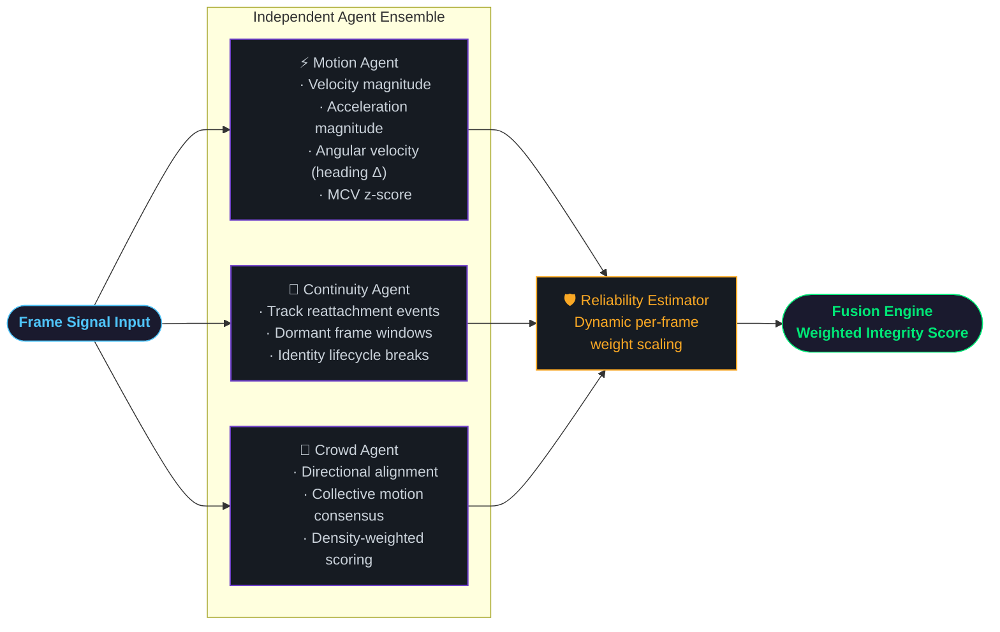
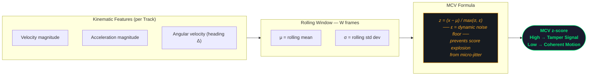
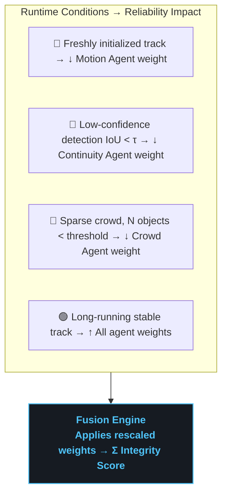
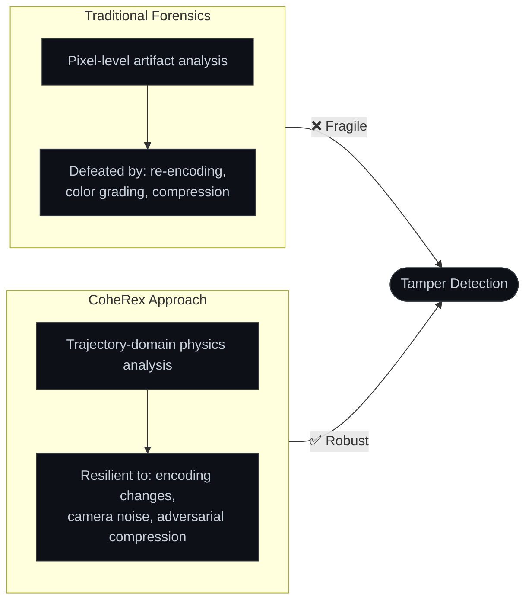

<div align="center">

<!-- HEADER BANNER -->
<picture>
  
</picture>

# CoheRex-Integrity

**Multi-Agent Temporal Consistency Verification & Video Forensics Framework**

[](https://python.org)
[](https://github.com/ultralytics/ultralytics)
[](https://streamlit.io)
[](https://scikit-learn.org)
[](https://opensource.org/licenses/MIT)

<br/>


*The CoheRex Streamlit Portal processing a video for temporal integrity violations.*

</div>

<br/>

> [!IMPORTANT]
> **CoheRex-Integrity** is a physics-first video forensics engine that detects synthetic temporal tampering — frame deletions, duplications, speed manipulation, clip splicing, and reverse playback — by modeling physical trajectories and human behavior over time rather than relying on pixel-level artifacts. A resilient, architecture-driven approach to video integrity verification.

<br/>

---

## 📌 Table of Contents

1. [What CoheRex Detects](#-what-coherex-detects)
2. [System Architecture](#-system-architecture)
3. [Core Innovations](#-core-innovations)
4. [Tech Stack & Requirements](#-tech-stack--requirements)
5. [Codebase Structure](#-codebase-structure)
6. [Dashboard Portal](#-dashboard-portal)
7. [Setup & Execution](#-setup--execution)
8. [Design Philosophy](#-design-philosophy)

---

## 🔍 What CoheRex Detects

> [!NOTE]
> CoheRex doesn't look at what a frame *looks like* — it looks at whether the **physics of the scene make sense across time**. It flags anomalies at the **trajectory domain**, not the pixel domain.

| Tampering Type | Detection Mechanism |
|:---:|:---|
| 🔴 **Frame Deletion** | Velocity / acceleration discontinuities in tracked trajectories |
| 🟠 **Frame Duplication** | Near-zero MCV z-scores sustained over abnormal windows |
| 🟡 **Speed Manipulation** | Kinematic anomalies inconsistent with natural motion physics |
| 🟣 **Clip Splicing** | Track lifecycle reattachments and identity breaks at cut points |
| 🔵 **Reverse Playback** | Bidirectional trajectory reversal patterns in the motion agent |

---

## 🏛️ System Architecture

The pipeline traverses **six discrete stages** — from raw video frames to a signed forensic verdict.



---

## ⚙️ Core Innovations

### ① Multi-Agent Decoupled Architecture

> [!TIP]
> Each agent is **fully independent** — it can be validated, extended, or swapped without affecting the rest of the pipeline. The fusion layer gracefully absorbs whatever signal is trustworthy.



---

### ② Motion Coherence Value (MCV)

The MCV is the **core physical signal** — the rolling z-score of kinematic features constrained by a dynamic noise floor.



**The complete MCV formula:**

$$z_t = \frac{x_t - \mu_W}{\max\!\left(\sigma_W,\; \epsilon\right)}$$

| Symbol | Meaning |
|:---:|:---|
| $x_t$ | Current feature value at frame $t$ |
| $\mu_W$ | Rolling mean over window $W$ |
| $\sigma_W$ | Rolling standard deviation over window $W$ |
| $\epsilon$ | Dynamic noise floor — prevents false alarms from micro-jitter |

> [!NOTE]
> A **high** MCV z-score signals a kinematic discontinuity — a physical impossibility that strongly correlates with temporal tampering.

---

### ③ Dynamic Reliability-Aware Fusion

Agent weights are **dynamically rescaled per frame** — unreliable agents are automatically attenuated before the fusion stage.

$$\text{Effective Weight}_i = \text{Base Weight}_i \times \text{Reliability}_i$$



> [!WARNING]
> Without this mechanism, a low-confidence agent on a sparse frame would **corrupt the verdict** — the reliability estimator prevents this entirely.

---

### ④ Random Forest Meta-Classifier

Per-frame integrity timelines are distilled into a **compact global feature vector**, then classified by a trained Random Forest.

$$\mathbf{F} = \bigl[\min(\text{Integrity}),\;\mu(\text{Integrity}),\;\sigma(\text{Integrity}),\;\text{Anomaly Density},\;\log(\max(\text{MCV})),\;\text{Segment Count}\bigr]$$

```mermaid
flowchart LR
    subgraph FE["  Feature Extraction  "]
        direction TB
        f1["min_integrity → worst single frame"]
        f2["mean_integrity → overall video health"]
        f3["score_volatility → temporal instability"]
        f4["anomaly_density → fraction of flagged segments"]
        f5["log(max_MCV) → peak kinematic deviation"]
        f6["segment_count → structural discontinuities"]
    end

    RF["Random Forest Classifier
    5-Fold Stratified Cross-Validation
    Macro F1 · ROC-AUC · Per-Fold Accuracy"]:::rf

    verdict(["TAMPER VERDICT
    + Confidence Probability"]):::verdict

    FE --> RF --> verdict

    classDef rf fill:#161b22,stroke:#f9a825,color:#f9a825,stroke-width:1.5px
    classDef verdict fill:#1a1a2e,stroke:#00e676,color:#00e676,font-weight:bold
```



---

## 🛠️ Tech Stack & Requirements

| Layer | Technology | Role |
|:---:|:---|:---|
| **Core Engine** | Python 3.8+, OpenCV, NumPy, SciPy | Frame decoding, matrix math, kinematic computation |
| **State Estimation** | FilterPy (Kalman Filters) | Multi-object trajectory propagation across occlusions |
| **Vision Models** | Ultralytics YOLOv8n, YOLOv8n-pose | Real-time object detection + human pose keypoint extraction |
| **Classification** | scikit-learn Random Forest | 5-fold stratified CV meta-classification of temporal features |
| **Serialization** | Joblib, Pandas | Model persistence and evaluation dataset management |
| **Dashboard** | Streamlit, Matplotlib | Interactive forensic portal and integrity chart rendering |
| **Logging & Progress** | Loguru, tqdm | Structured terminal logging and pipeline progress visualization |
| **Video Player** | HTML5 / Vanilla JS | Dual-sync player with hover pan/zoom mirroring |

---

## 📂 Codebase Structure

```
coherex-integrity/
│
├── coherex/                         ← Core architectural package
│   ├── config.py                    ← Single source of truth — thresholds & fusion params
│   │
│   ├── detection/
│   │   └── yolo_detector.py         ← YOLOv8 object detection wrapper
│   │
│   ├── tracking/
│   │   ├── manager.py               ← Multi-object track lifecycle & ID management
│   │   ├── kalman.py                ← Per-track state estimation via Kalman filtering
│   │   └── pose.py                  ← Pose association tracking routines
│   │
│   ├── trajectory/
│   │   └── store.py                 ← Persistent kinematic history per track ID
│   │
│   ├── coherence/
│   │   └── mcv.py                   ← MCV z-score computation + dynamic noise floor
│   │
│   ├── integrity/
│   │   ├── motion_agent.py          ← Agent I  : velocity / acceleration / angular analysis
│   │   ├── continuity_agent.py      ← Agent II : track lifecycle stability scoring
│   │   ├── crowd_agent.py           ← Agent III: collective directional alignment
│   │   ├── reliability.py           ← Dynamic per-frame agent weight adjustment
│   │   └── fusion_engine.py         ← Weighted multi-agent score fusion
│   │
│   └── meta/
│       ├── feature_extractor.py     ← Global temporal feature vector generation
│       └── classifier.py            ← Random Forest training, evaluation, inference
│
├── frontend/
│   └── app.py                       ← Streamlit dashboard — main entry point
│
├── scripts/
│   ├── create_tampered_videos.py    ← Synthetic tamper dataset generation
│   ├── evaluate_dataset.py          ← Batch feature extraction across dataset
│   ├── train_meta_classifier.py     ← RF training with stratified cross-validation
│   └── run_pipeline.py              ← Isolated single-file forensic analysis
│
├── data/
│   ├── raw_videos/                  ← Baseline authentic video inputs
│   ├── models/                      ← Persisted classifier and scaler (joblib)
│   └── evaluation/                  ← results_test.csv — classifier training data
│
├── docs/images/                     ← Portal screenshots and documentation assets
├── requirements.txt
├── setup.py
└── README.md
```

---

## 🖥️ Dashboard Portal

<div align="center">


*The upload and configuration panel of the CoheRex forensic dashboard — `http://localhost:8501`*
</div>

<br/>

The dashboard provides **five integrated analysis panels**:

| Panel | Functionality |
|:---:|:---|
| **① Upload Interface** | Video upload + temporal window parameters + agent weight overrides |
| **② Dual Sync Player** | Frame-accurate original vs. annotated playback with hover pan/zoom mirroring |
| **③ Integrity Timeline** | Continuous score plot with flagged segment shading and hover-to-seek |
| **④ Score Histogram** | Frame-level distribution exposing bimodal splits characteristic of splice boundaries |
| **⑤ Verdict Panel** | AI classifier output with confidence probability, statistics, and MCV violation log |

---

## 🚀 Setup & Execution

> [!TIP]
> Use a pristine virtual environment to prevent dependency conflicts with other ML frameworks.

### Step I — Environment Setup

```bash
# Create and activate a virtual environment
python -m venv venv
source venv/bin/activate       # Linux / macOS
venv\Scripts\activate          # Windows

# Install all dependencies and link the local package
pip install -r requirements.txt
pip install -e .
```

### Step II — Dataset Preparation

```bash
# Generate tampered variants from authentic baseline videos
python scripts/create_tampered_videos.py
```

Synthesizes frame deletions, duplications, speed changes, splices, and reversal clips from baseline inputs, producing a fully labeled evaluation dataset.

### Step III — Batch Evaluation

```bash
# Extract temporal feature vectors across the full dataset
python scripts/evaluate_dataset.py
```

Outputs `data/evaluation/results_test.csv` — per-video feature vectors with ground-truth labels.

### Step IV — Train the Meta-Classifier

```bash
# Train the Random Forest using 5-fold stratified cross-validation
python scripts/train_meta_classifier.py --csv data/evaluation/results_test.csv
```

Saves `data/models/meta_classifier.pkl`. Reports per-fold accuracy, macro F1, and ROC-AUC.

### Step V — Launch the Dashboard

```bash
streamlit run frontend/app.py
```

Navigate to **`http://localhost:8501`** to begin forensic investigations.

---

## 🧠 Design Philosophy

> [!IMPORTANT]
> **CoheRex is built on a single core thesis: tampering breaks physics before it breaks pixels.**



Compression artifacts, color grading, and resolution changes can disguise pixel-level edits — but **no post-processing pipeline can reconstruct coherent kinematic trajectories** for objects that weren't there, or smooth over the Newtonian impossibilities introduced by frame deletion.

The multi-agent architecture follows from this: different physical properties — velocity coherence, track lifecycle integrity, collective motion consensus — are maximally informative under different scene conditions. Decoupling the agents and fusing them through a reliability layer means each contributes exactly as much as it can be trusted to, **and no more**.

---

<div align="center">
<br/>
<sub>Crafted for the advancement of computational video forensics.</sub>
</div>
