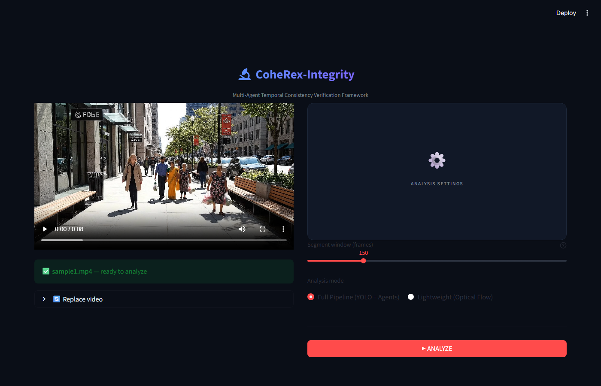
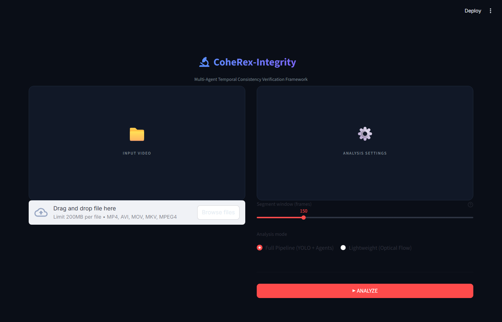

<div align="center">

<!-- HEADER BANNER -->
<picture>
  
</picture>

# CoheRex-Integrity

**Multi-Agent Temporal Consistency Verification & Video Forensics Framework**

[](https://python.org)
[](https://github.com/ultralytics/ultralytics)
[](https://streamlit.io)
[](https://scikit-learn.org)
[](https://opensource.org/licenses/MIT)

<br/>



*The CoheRex Streamlit Portal processing a video for temporal integrity violations.*

</div>

<br/>

> [!IMPORTANT]
> **CoheRex-Integrity** is a physics-first video forensics engine that detects synthetic temporal tampering — frame deletions, duplications, speed manipulation, clip splicing, and reverse playback — by modeling physical trajectories and human behavior over time rather than relying on pixel-level artifacts. A resilient, architecture-driven approach to video integrity verification.

---

## What CoheRex Detects

> [!NOTE]
> CoheRex doesn't look at what a frame *looks like* — it looks at whether the **physics of the scene make sense across time**.

It flags:

| 🟥 Tampering Type | 🔬 Detection Mechanism |
|:---|:---|
| **Frame Deletion** | Velocity/acceleration discontinuities in tracked trajectories |
| **Frame Duplication** | Near-zero MCV z-scores sustained over abnormal windows |
| **Speed Manipulation** | Kinematic anomalies inconsistent with natural motion physics |
| **Clip Splicing** | Track lifecycle reattachments and identity breaks at cut points |
| **Reverse Playback** | Bidirectional trajectory reversal patterns in the motion agent |

---

## System Architecture

The pipeline traverses six stages — from raw video frames to a signed forensic verdict.

```
┌─────────────────────────────────────────────────────────────────────────────┐
│                                                                             │
│   RAW VIDEO                                                                 │
│       │                                                                     │
│       ▼                                                                     │
│  ┌──────────────────────────────────────────┐                               │
│  │        I. DATA ACQUISITION               │                               │
│  │  Frame Decode · FPS Extraction           │                               │
│  └──────────────────────┬───────────────────┘                               │
│                         │                                                   │
│            ┌────────────┴────────────┐                                      │
│            ▼                        ▼                                       │
│  ┌──────────────────┐    ┌──────────────────┐                               │
│  │  YOLOv8 Detector │    │ YOLOv8-Pose Est. │                               │
│  │  Bounding Boxes  │    │ Keypoint Geom.   │                               │
│  └────────┬─────────┘    └────────┬─────────┘                               │
│           └──────────┬───────────┘                                          │
│                      ▼                                                      │
│  ┌──────────────────────────────────────────┐                               │
│  │    II. TRACK MANAGER + KALMAN FILTERS    │                               │
│  │         State Estimation · Trajectory    │                               │
│  └──────────────────────┬───────────────────┘                               │
│                         │                                                   │
│                         ▼                                                   │
│  ┌──────────────────────────────────────────┐                               │
│  │     III. MOTION COHERENCE ENGINE         │                               │
│  │   Rolling z-scores · MCV · Noise Floor   │                               │
│  └──────────────────────┬───────────────────┘                               │
│                         │                                                   │
│         ┌───────────────┼────────────────┐                                  │
│         ▼               ▼                ▼                                  │
│  ┌────────────┐  ┌────────────┐  ┌────────────┐                             │
│  │   MOTION   │  │CONTINUITY  │  │   CROWD    │                             │
│  │   AGENT    │  │   AGENT    │  │   AGENT    │                             │
│  │ Kinematics │  │ Lifecycle  │  │ Alignment  │                             │
│  └─────┬──────┘  └─────┬──────┘  └─────┬──────┘                            │
│        │               │               │  ← Reliability Estimator          │
│        └───────────────┼───────────────┘    (dynamic weight scaling)       │
│                        ▼                                                    │
│  ┌──────────────────────────────────────────┐                               │
│  │         IV. FUSION ENGINE                │                               │
│  │   Weighted Score Aggregation per Frame   │                               │
│  └──────────────────────┬───────────────────┘                               │
│                         ▼                                                   │
│  ┌──────────────────────────────────────────┐                               │
│  │     V. RANDOM FOREST META-CLASSIFIER     │                               │
│  │  Volatility · Min/Mean · Density · Log   │                               │
│  └──────────────────────┬───────────────────┘                               │
│                         ▼                                                   │
│  ┌──────────────────────────────────────────┐                               │
│  │       VI. FORENSIC VERDICT + REPORT      │                               │
│  │  Streamlit Portal · Dual Sync Player     │                               │
│  └──────────────────────────────────────────┘                               │
│                                                                             │
└─────────────────────────────────────────────────────────────────────────────┘
```

---

## Core Innovations

### ① Multi-Agent Decoupled Architecture

Instead of one monolithic tamper detector, CoheRex delegates to three independent agents evaluating orthogonal physical properties simultaneously:

> [!TIP]
> Each agent can be independently validated, extended, or replaced — the fusion layer absorbs whatever is trustworthy.

```
                    ┌────────────────────────────────────┐
                    │         FRAME SIGNAL INPUT         │
                    └──────────┬──────────┬──────────────┘
                               │          │          │
              ┌────────────────▼─┐  ┌─────▼──────┐  ┌▼──────────────┐
              │   MOTION AGENT   │  │ CONTINUITY │  │  CROWD AGENT  │
              │                  │  │   AGENT    │  │               │
              │ · Velocity       │  │            │  │ · Directional │
              │ · Acceleration   │  │ · Track    │  │   Alignment   │
              │ · Angular Δ      │  │   reattach │  │ · Collective  │
              │ · MCV z-score    │  │ · Dormancy │  │   consensus   │
              └────────────┬─────┘  └─────┬──────┘  └──────┬────────┘
                           │              │                 │
                           └──────────────▼─────────────────┘
                                   RELIABILITY ESTIMATOR
                                (scales weights per-frame)
                                          │
                                          ▼
                                   FUSION ENGINE
                                  (frame integrity)
```

---

### ② Motion Coherence Value (MCV)

The MCV is the core physical signal. It computes rolling z-scores of kinematic features over a sliding window, with a **dynamic noise floor** that prevents false alarms from micro-jitter.

The formula guarantees resilience against sub-pixel tracking noise:

$$ z = \frac{x - \mu}{\max(\sigma, \epsilon)} $$

**Where:**
* $x$ = Current feature value (velocity magnitude, acceleration, or angular velocity)
* $\mu$ = Rolling mean over window $W$
* $\sigma$ = Rolling standard deviation over window $W$
* $\epsilon$ = Dynamic noise floor constraint

---

### ③ Dynamic Reliability-Aware Fusion

Agent weights are not static. The fusion engine adjusts them every frame based on how trustworthy each agent is *right now*:

$$ \text{Effective Weight}_i = \text{Base Weight}_i \times \text{Reliability}_i $$

> [!WARNING]
> This means unreliable signals are automatically muted rather than polluting the verdict!

**Reliability Condition Mapping:**

| Scenario | Reliability Impact |
|:---|:---|
| 🔴 **Freshly initialized track** | $\downarrow$ Motion Agent weight |
| 🔴 **Low-confidence detection (IoU < $\tau$)** | $\downarrow$ Continuity Agent weight |
| 🔴 **Sparse crowd (<N objects)** | $\downarrow$ Crowd Agent weight |
| 🟢 **Long-running stable track** | $\uparrow$ All agent weights |

---

### ④ Random Forest Meta-Classifier

The per-frame integrity scores are aggregated into a **global temporal feature vector** which a trained Random Forest classifies:

$$ \mathbf{F} = \Big[ \min(\text{Integrity}), \, \mu(\text{Integrity}), \, \sigma(\text{Integrity}), \, \text{Anomaly Density}, \, \log(\max(\text{MCV})), \, \text{Segment Count} \Big] $$

```
  Per-frame integrity timeline
         ▼
  ┌─────────────────────────────────────────────────────┐
  │               FEATURE EXTRACTION                   │
  │                                                     │
  │   min_integrity       →  worst single frame        │
  │   mean_integrity      →  overall video health      │
  │   score_volatility    →  temporal instability      │
  │   anomaly_density     →  fraction of flagged segs  │
  │   log(max_MCV)        →  peak kinematic deviation  │
  │   segment_count       →  structural discontinuity  │
  └──────────────────────────┬──────────────────────────┘
                             │
                             ▼
                    RANDOM FOREST
              (5-Fold Stratified Cross-Val)
                             │
                             ▼
                    ┌─────────────────┐
                    │  TAMPER VERDICT │
                    │  + Probability  │
                    └─────────────────┘
```

---

## Tech Stack & Requirements

| Layer | Technology | Role |
|:---|:---|:---|
| **Core Engine** | Python 3.8+, OpenCV, NumPy, SciPy | Frame decoding, matrix math, kinematic computation |
| **State Estimation** | FilterPy (Kalman Filters) | Multi-object trajectory propagation across occlusions |
| **Vision Models** | Ultralytics YOLOv8n, YOLOv8n-pose | Real-time object detection + human pose keypoint extraction |
| **Classification** | scikit-learn Random Forest | 5-fold stratified CV meta-classification of temporal features |
| **Serialization** | Joblib, Pandas | Model persistence and evaluation dataset management |
| **Dashboard** | Streamlit, Matplotlib | Interactive forensic portal and integrity chart rendering |
| **Logging & Tracking** | Loguru, tqdm | Terminal logging and pipeline execution progress visualization |
| **Video Player** | HTML5 / Vanilla JS | Dual-sync player with hover pan/zoom mirroring |

---

## Codebase Structure

```
coherex-integrity/
│
├── coherex/                        # Core architectural package
│   ├── config.py                   # Single source of truth — thresholds & fusion params
│   │
│   ├── detection/
│   │   └── yolo_detector.py        # YOLOv8 object detection wrapper
│   │
│   ├── tracking/
│   │   ├── manager.py              # Multi-object track lifecycle & ID management
│   │   ├── kalman.py               # Per-track state estimation via Kalman filtering
│   │   └── pose.py                 # Pose association tracking routines
│   │
│   ├── trajectory/
│   │   └── store.py                # Persistent kinematic history per track ID
│   │
│   ├── coherence/
│   │   └── mcv.py                  # MCV z-score computation + noise floor
│   │
│   ├── integrity/
│   │   ├── motion_agent.py         # Agent I: velocity/acceleration/angular analysis
│   │   ├── continuity_agent.py     # Agent II: track lifecycle stability scoring
│   │   ├── crowd_agent.py          # Agent III: collective directional alignment
│   │   ├── reliability.py          # Dynamic per-frame weight adjustment
│   │   └── fusion_engine.py        # Weighted multi-agent score fusion
│   │
│   └── meta/
│       ├── feature_extractor.py    # Global temporal feature vector generation
│       └── classifier.py           # Random Forest training, evaluation, inference
│
├── frontend/
│   └── app.py                      # Streamlit dashboard — main entry point
│
├── scripts/
│   ├── create_tampered_videos.py   # Synthetic tamper dataset generation
│   ├── evaluate_dataset.py         # Batch feature extraction across dataset
│   ├── train_meta_classifier.py    # RF training with stratified cross-validation
│   └── run_pipeline.py             # Isolated single-file forensic analysis
│
├── data/
│   ├── raw_videos/                 # Baseline authentic video inputs
│   ├── models/                     # Persisted classifier and scaler (joblib)
│   └── evaluation/                 # results_test.csv — classifier training data
│
├── docs/images/                    # Portal screenshots and documentation assets
├── requirements.txt
├── setup.py
└── README.md
```

---

## Dashboard Portal

<div align="center">


*The upload and configuration panel of the CoheRex forensic dashboard.*
</div>

The dashboard runs at `http://localhost:8501` and provides:

**① Dual-Panel Upload Interface** — Video upload on the left; temporal window parameters and agent weight overrides on the right.

**② Side-by-Side Synchronized Player** — Original vs. annotated output with frame-accurate sync, adjustable playback speed, and mouse-driven hover pan/zoom mirroring for sub-region inspection.

**③ Real-Time Integrity Timeline** — Continuous integrity score plot with flagged segment shading and interactive hover to seek to any anomaly timestamp.

**④ Score Distribution Histogram** — Full frame-level score distribution exposing bimodal splits characteristic of splice boundaries.

**⑤ Forensic Verdict Panel** — AI classifier output with confidence probability, macroscopic temporal statistics, and timestamped violation log with per-frame MCV values.

---

## Setup & Execution

### I. Environment

> [!TIP]
> Using a pristine virtual environment is strongly recommended to prevent dependency conflicts with other ML frameworks.

```bash
# Create and activate a virtual environment
python -m venv venv
source venv/bin/activate        # Linux / macOS
venv\Scripts\activate           # Windows

# Install dependencies and link the local package
pip install -r requirements.txt
pip install -e .
```

### II. Dataset Preparation

```bash
# Generate tampered variants from authentic baseline videos
python scripts/create_tampered_videos.py
```

This synthesizes frame deletions, duplications, speed changes, splices, and reversal clips from any authentic input, creating a labeled evaluation dataset.

### III. Batch Evaluation

```bash
# Extract temporal feature vectors across the full dataset
python scripts/evaluate_dataset.py
```

Outputs `data/evaluation/results_test.csv` with per-video feature vectors and ground-truth labels.

### IV. Train the Meta-Classifier

```bash
# Train the Random Forest using 5-fold stratified cross-validation
python scripts/train_meta_classifier.py --csv data/evaluation/results_test.csv
```

Saves the fitted classifier to `data/models/meta_classifier.pkl`. Prints per-fold accuracy, macro F1, and ROC-AUC.

### V. Launch the Dashboard

```bash
streamlit run frontend/app.py
```

Navigate to `http://localhost:8501` to begin forensic investigations.

---

## Design Philosophy

> [!IMPORTANT]
> CoheRex is built on a single core thesis: **tampering breaks physics before it breaks pixels**.

Compression artifacts, color grading, and resolution changes can all disguise pixel-level edits — but no post-processing pipeline can reconstruct coherent kinematic trajectories for objects that weren't there, or smooth over the Newtonian impossibilities introduced by frame deletion. By elevating the analysis from the pixel domain to the trajectory domain, CoheRex gains resilience against encoding changes, camera noise, and adversarial compression that defeat traditional forensic approaches.

The multi-agent architecture follows from this: different physical properties — velocity coherence, track lifecycle integrity, collective motion consensus — are maximally informative under different scene conditions. Decoupling the agents and fusing them through a reliability layer means each contributes exactly as much as it can be trusted to, and no more.

---

<div align="center">

*Crafted for the advancement of computational video forensics.*

</div>
