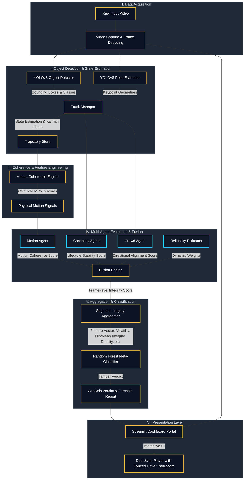

<div align="center">

# 🏛️ CoheRex-Integrity
*Multi-Agent Temporal Consistency Verification & Video Forensics Framework*

[](https://www.python.org/)
[](https://github.com/ultralytics/ultralytics)
[](https://streamlit.io/)
[](https://opensource.org/licenses/MIT)

<br/>

<p><i>The CoheRex Streamlit Portal processing a video for temporal integrity.</i></p>

</div>

<br/>

> **CoheRex-Integrity** is a state-of-the-art computer vision and machine learning framework meticulously designed to detect synthetic temporal tampering—such as frame deletions, duplications, speed manipulation, clip splicing, and reverse playback—in video files. By modeling physical trajectories and human behavior over time instead of relying solely on pixel-level artifacts, CoheRex provides a resilient, architecture-driven approach to video forensics.

<hr/>

<div align="center">
  <h2>🗺️ System Architecture</h2>
</div>

The following diagram illustrates the classical data processing pipeline of the CoheRex-Integrity framework, traversing from raw video acquisition to final forensic verdicts:



<hr/>

<div align="center">
  <h2>✨ Core Innovations</h2>
</div>

* **Multi-Agent Decoupled Paradigm:** Instead of using a monolithic detector, CoheRex delegates temporal consistency evaluation to independent agents evaluating discrete physical properties:
    *   **Motion Agent:** Tracks smooth trajectory physics (velocity, acceleration, angular changes).
    *   **Continuity Agent:** Evaluates tracking lifecycle events (reattachments, dormant frames, missing frames).
    *   **Crowd Agent:** Analyzes collective directional alignment in densely populated scenes.
* **Robust Motion Coherence Value (MCV):** A bespoke physical metric computing the rolling z-score of kinematic features. It utilizes a dynamic **noise floor** to prevent score explosion from minute spatial jitters.
* **Dynamic Reliability-Aware Fusion:** The system adapts frame-by-frame by dynamically scaling agent weights:
    $$\text{Effective Weight}_i = \text{Base Weight}_i \times \text{Reliability}_i$$
    This mechanism intelligently neutralizes untrustworthy agents, such as newly initialized tracks or low-confidence detections.
* **Random Forest Meta-Classifier:** Consolidates temporal statistics across the video (e.g., minimum/mean integrity, volatility, anomaly density, log of max MCV) to produce highly robust tampering verdicts.
* **Dual-Mode Synchronized Player:** A refined dashboard featuring an HTML5/JS synchronized video player (original input vs. annotated output) supporting sub-frame sync, customizable speeds, and **mouse-driven hover pan/zoom mirroring** for microscopic splice investigations.

<hr/>

<div align="center">
  <h2>🛠️ Tech Stack & Frameworks</h2>
</div>

| Category | Framework / Library | Functionality |
| :--- | :--- | :--- |
| **Core Engine** | Python 3.8+, OpenCV, NumPy, SciPy, Pandas | System logic, matrix mathematics, matrix transformations, logging, and evaluation dataset management. |
| **Computer Vision** | Ultralytics YOLOv8, FilterPy | Real-time object detection (`yolov8n.pt`), human pose keypoint estimation (`yolov8n-pose.pt`), and Kalman filtering for tracking state propagation. |
| **Machine Learning** | Scikit-Learn, Joblib | Stratified 5-Fold Cross Validation and Random Forest classification of temporal feature vectors. |
| **Presentation** | Streamlit, Matplotlib, HTML5/CSS3/Vanilla JS | Interactive web dashboard architecture, dynamic integrity charts, histograms, ROC plotting, and custom dual-video synced player components. |

<hr/>

<div align="center">
  <h2>📂 Codebase Topology</h2>
</div>

* **[`coherex/`](coherex/)**: Core architectural package.
    * **`config.py`**: Immutable dataclass serving as the single source of truth for thresholds and fusion parameters.
    * **`detection/`**, **`tracking/`**, **`trajectory/`**: State estimation encompassing YOLO wrappers, Kalman managers, and trajectory stores.
    * **`coherence/`**, **`integrity/`**: Mathematical engines computing MCV z-scores and the multi-agent fusion ecosystem.
    * **`meta/`**: Global feature extraction and Random Forest meta-classifier implementation.
* **[`frontend/`](frontend/)**: User interface components incorporating `app.py`, the principal Streamlit dashboard.
* **[`scripts/`](scripts/)**: Operational utilities for dataset creation, batch evaluations, ML training, and isolated testing.
* **[`docs/images/`](docs/images/)**: Aesthetic assets and portal screenshots.

<hr/>

<div align="center">
  <h2>🖥️ Localhost Web Portal</h2>
</div>

<div align="center">

<p><i>The intuitive upload interface of the CoheRex dashboard.</i></p>
</div>

The CoheRex dashboard runs locally and mounts on `http://localhost:8501`. 

### Interactive Functionalities
1. **Dual-Panel Controls:** Upload inputs on the left, adjust temporal integrity window parameters on the right.
2. **Side-by-Side Synced Video Player:** Compares original vs. annotated output with dynamic hover-zoom mirroring.
3. **Real-Time Analytics & Charts:** Renders temporal integrity plots and score histograms automatically identifying compromised sequences.
4. **Forensic Metrics & Anomaly Logs:** Displays macroscopic temporal statistics, AI Classifier Verdicts, and exact timestamped logs of identified violations.

<hr/>

<div align="center">
  <h2>⚙️ Operational Procedure</h2>
</div>

Follow these precise steps to deploy and execute the CoheRex-Integrity framework locally:

### I. Environment Setup
```bash
# Initialize a pristine virtual environment
python -m venv venv

# Activate the environment (Windows)
venv\Scripts\activate

# Install the dependencies and link the package
pip install -r requirements.txt
pip install -e .
```

### II. Dataset Preparation & Synthesis
```bash
# Synthesize tampered evaluations from authentic baseline inputs
python scripts/create_tampered_videos.py
```

### III. Execution & Batch Evaluation
```bash
# Conduct a complete feature extraction across the dataset
python scripts/evaluate_dataset.py
```

### IV. Machine Learning (Meta-Classifier Training)
```bash
# Train the Random Forest framework using cross-validation
python scripts/train_meta_classifier.py --csv data/evaluation/results_test.csv
```

### V. Invoking the Web Dashboard
```bash
# Boot the Streamlit server
streamlit run frontend/app.py
```
Navigate to `http://localhost:8501` to commence visual forensic investigations.

<br/>

<div align="center">
<i>Crafted with precision for the advancement of computational video forensics.</i>
</div>
